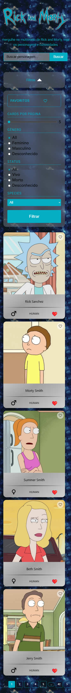
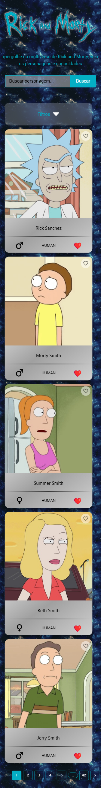
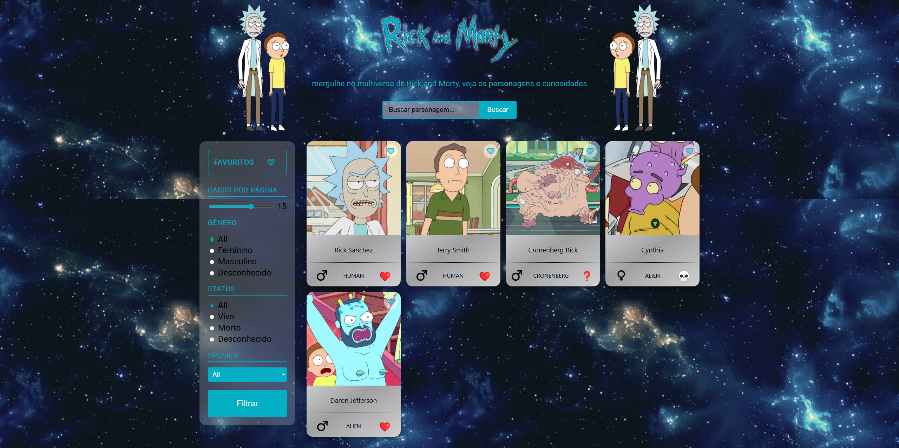
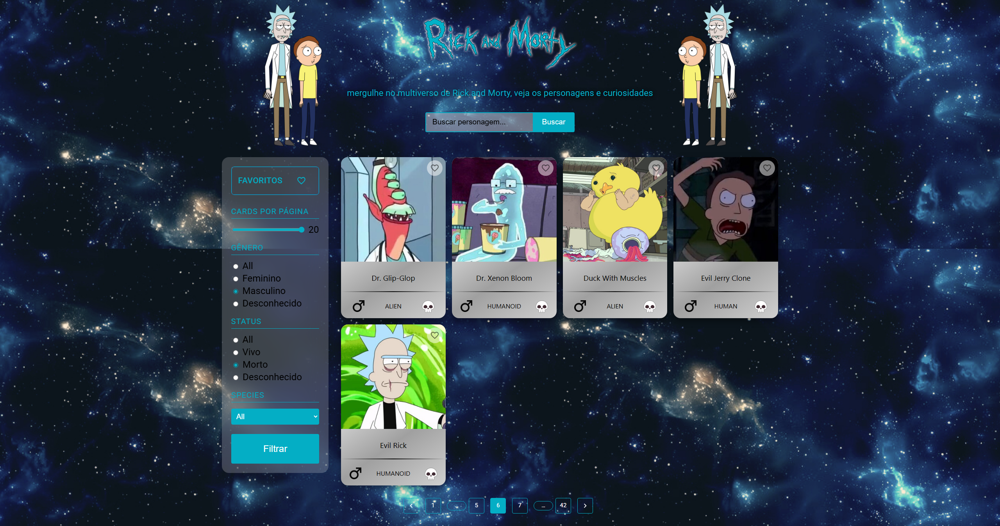
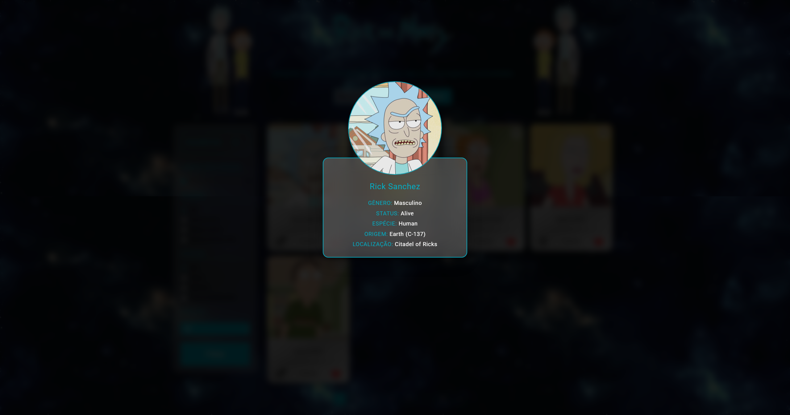

<<<<<<< HEAD
# Rick and Morty Explorer 🧪🛸

Este projeto é uma aplicação web desenvolvida com **React** e **Vite**, que consome a [API pública do Rick and Morty](https://rickandmortyapi.com/), permitindo explorar os personagens da série através de uma interface interativa com **filtros**, **favoritos**, **paginação**, e **detalhamento com modal**.

## 🔍 Funcionalidades

### ✅ Listagem de Personagens
- Consome a API da série Rick and Morty para listar personagens.
- Atualiza a listagem dinamicamente conforme a navegação entre páginas.

### 🔎 Filtros Avançados
- **Gênero**, **Espécie**, **Status**.
- Campo de **busca por nome**.
- Seleção de quantidade de cards por página.
- Compatível com versões mobile com botão para alternar a visibilidade dos filtros.

### ⭐ Favoritos com persistência
- É possível favoritar personagens.
- Os favoritos são salvos no `localStorage`, garantindo persistência mesmo após recarregar a página.
- Exibição exclusiva de personagens favoritados com um clique.

### 📄 Paginação
- Controle de navegação entre páginas fornecidas pela API.
- Escondido automaticamente quando a visualização está no modo "Favoritos".

### ℹ️ Modal de Detalhes
- Cada card de personagem pode ser clicado para abrir um **modal** com mais informações detalhadas.

### 🎨 UI com Material UI
- Algumas partes da interface utilizam componentes do [Material UI](https://mui.com/) para uma aparência mais moderna e consistente.

---

## 🚀 Tecnologias Utilizadas

- **React** com **Vite** para um desenvolvimento moderno e rápido.
- **Material UI** para componentes prontos e estilização.
- **CSS modular** com arquivos separados por componente.
- **Fetch API** para comunicação com o backend da API do Rick and Morty.
- **LocalStorage** para salvar dados de favoritos.

---

## 🧠 Hooks do React

O projeto utiliza os principais hooks do React para gerenciamento de estado e efeitos colaterais:

- `useState`: para controlar os dados da API, filtros, favoritos, paginação e UI.
- `useEffect`: para lidar com requisições, aplicar filtros com debounce e persistência de favoritos no `localStorage`.

--- 

## 📸 Imagens do projeto












---

## ⚙️ Como rodar o projeto

1. Clone o repositório:
   ```bash
   git clone https://github.com/kimbioni/Rick-and-Morty_App.git


=======
# Rick and Morty Explorer 🧪🛸

Este projeto é uma aplicação web desenvolvida com **React** e **Vite**, que consome a [API pública do Rick and Morty](https://rickandmortyapi.com/), permitindo explorar os personagens da série através de uma interface interativa com **filtros**, **favoritos**, **paginação**, e **detalhamento com modal**.

## 🔍 Funcionalidades

### ✅ Listagem de Personagens
- Consome a API da série Rick and Morty para listar personagens.
- Atualiza a listagem dinamicamente conforme a navegação entre páginas.

### 🔎 Filtros Avançados
- **Gênero**, **Espécie**, **Status**.
- Campo de **busca por nome**.
- Seleção de quantidade de cards por página.
- Compatível com versões mobile com botão para alternar a visibilidade dos filtros.

### ⭐ Favoritos com persistência
- É possível favoritar personagens.
- Os favoritos são salvos no `localStorage`, garantindo persistência mesmo após recarregar a página.
- Exibição exclusiva de personagens favoritados com um clique.

### 📄 Paginação
- Controle de navegação entre páginas fornecidas pela API.
- Escondido automaticamente quando a visualização está no modo "Favoritos".

### ℹ️ Modal de Detalhes
- Cada card de personagem pode ser clicado para abrir um **modal** com mais informações detalhadas.

### 🎨 UI com Material UI
- Algumas partes da interface utilizam componentes do [Material UI](https://mui.com/) para uma aparência mais moderna e consistente.

---

## 🚀 Tecnologias Utilizadas

- **React** com **Vite** para um desenvolvimento moderno e rápido.
- **Material UI** para componentes prontos e estilização.
- **CSS modular** com arquivos separados por componente.
- **Fetch API** para comunicação com o backend da API do Rick and Morty.
- **LocalStorage** para salvar dados de favoritos.

---

## 🧠 Hooks do React

O projeto utiliza os principais hooks do React para gerenciamento de estado e efeitos colaterais:

- `useState`: para controlar os dados da API, filtros, favoritos, paginação e UI.
- `useEffect`: para lidar com requisições, aplicar filtros com debounce e persistência de favoritos no `localStorage`.

--- 

## 📸 Imagens do projeto


**Figura 1**: Página inicial do projeto exibindo a Home Page.


**Figura 2**: Página principal do projeto exibindo o conteúdo completo na versão desktop.


**Figura 3**: Página principal do projeto exibindo o conteúdo completo na versão mobile.


**Figura 4**: Página principal do projeto exibindo o conteúdo completo na versão mobile + filtro retrátil.


**Figura 5**: Exibição da funcionalidade de favoritos, utilizando localStorage para armazenar os cards


**Figura 6**: Exibição da funcionalidade de multiplos filtros, podendo filtrar os cards utilizando 1 ou mais filtros


**Figura 7**: Modal de cards contendo mais informaçõs dos personagens

---

## ⚙️ Como rodar o projeto

1. Clone o repositório:
   ```bash
   git clone https://github.com/kimbioni/Rick-and-Morty_App.git

## 🧪 Deploy do projeto

https://desafio-dorotech-beta.vercel.app/
>>>>>>> 134e4aea55847aa3419cebbccad615a03c2ddc2e
